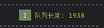
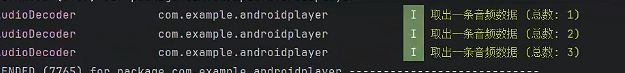

# 实现四个线程，实现音频播放和音视频播放

* 实现循环缓冲区
* 利用提供的AAudioRender播放音频

## 实现思路

1. 修改解复用代码，当为视频帧时，存入视频队列，当为音频帧时，传入音频队列
2. 创建环形缓冲区，环形缓冲区通过固定大小的数组和两个指针（读指针和写指针）实现循环存储，当指针到达数组末尾时，会绕回数组的开头，读指针会读完会指向下一个可读数据的位置，写指针写完会指向下一个可写入数据的位置。
3. 创建audiodecoder，实现从音频队列中取数据，解码后放入环形环形缓冲区。
4. 调用AAudioRender的回调函数，从环形缓冲区中读取数据，将音频渲染。

## 今日未实现

音频未能播放，解复用时可以正常将音频数据写入队列，但每次audiodecoder只能从队列里取三个音频数据帧。

1. 写入的队列长度

2. audiodecoder收到的数据

